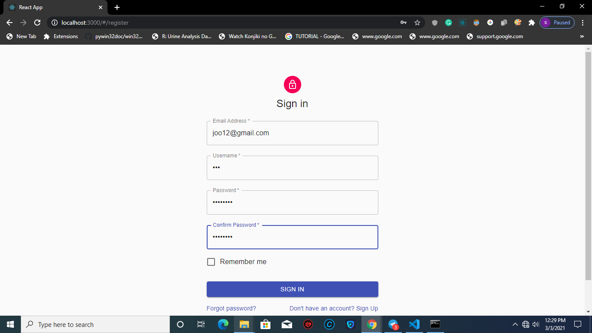

# react-admin REST API

## What is the use of this project

This project is created with react-admin which is a reactjs framework
and material ui.
 
 1. You can register and login to the application
 2. you can create orders
 3. you can delete and edit orders
 4. search for an orders
 5. paginate orders

## Live Application URL
[Fuzon media react-admin rest api](https://www.google.com "Live Application Link")
Go to this link to visit our live application

## prerequisite
  #### Nodejs
  check if you have nodejs installed on your machine
  by this command  `node --version`. If you dont have nodejs installed
  on your machine install it on your machine.
  #### rest-laravel-jwt
   This application make http calls to [rest-laravel-jwt](https://www.google.com "Laravel Rest API").
   clone the repo [rest-laravel-jwt](https://www.google.com "Laravel Rest API") and 
   follow the instruction of [READM.MD](https://www.google.com "README file of Laravel Rest API")
   to run the rest-laravela-api on local.
    
  

## Run the application in local machine
  If you done with our prerequisite you are ready to run our application.

  ### Run following commands

  1.Clone this repo to run this project on your local machine
   `git clone https://github.com/fuzonmedia-projects/react-admin-rest-api.git`
  2.Install all dependancy and packages
   `npm install`
  3.Start the react app
   `npm start` 

## Start with the application
 #### register as a user
 you can type the link <http://localhost:3000/#/register> in your browser
 and to go to register page
 
 

## Resources
 ##### reactjs
  Go to the link to understand [Reactjs](https://reactjs.org)
 #### react-admin
  Visit [react-admin](https://marmelab.com/react-admin/) official site to know more 
 #### material-ui
  see the documentaion of [material-ui](https://material-ui.com/)