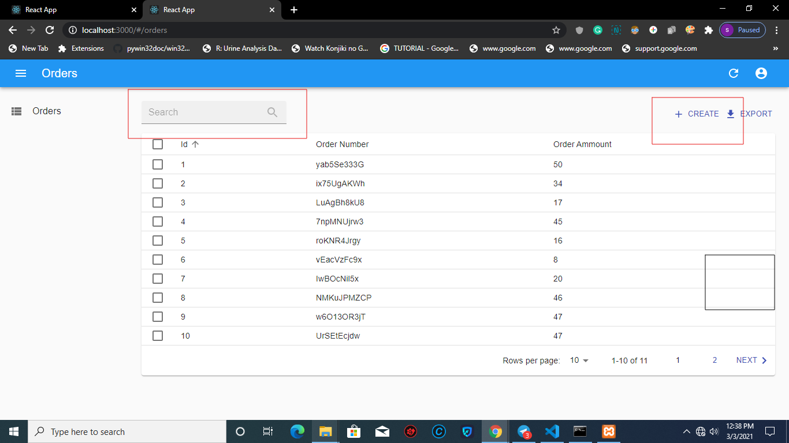

# react-admin REST API

## What is the use of this project

This project is created with react-admin which is a reactjs framework
and material ui.
 
 1. You can register and login to the application
 2. you can create orders
 3. you can delete and edit orders
 4. search for an orders
 5. paginate orders

## Live Application URL
[Fuzon media react-admin rest api](https://fir-sample-9af65.web.app "Live Application Link")
Go to this link to visit our live application

## prerequisite
  #### Nodejs
  check if you have nodejs installed on your machine
  by this command  `node --version`. If you dont have nodejs installed
  on your machine install it on your machine.
  #### rest-laravel-jwt
   This application make http api calls to our [rest-laravel-jwt](https://github.com/fuzonmedia-projects/rest-laravel-jwt/ "Laravel Rest API") api. clone the repo [rest-laravel-jwt](https://github.com/fuzonmedia-projects/rest-laravel-jwt/ "Laravel Rest API") and follow the instruction of [READM.MD](https://github.com/fuzonmedia-projects/rest-laravel-jwt/blob/master/readme.md "README file of  Laravel Rest API")
   to run the rest-laravela-api on local.
 
    
  

## Run the application in local machine
  If you done with our prerequisite then you are ready to run our application.

### Run following commands

1. Clone the repo to run this project on your local machine

`git clone https://github.com/fuzonmedia-projects/react-admin-rest-api.git`
   
after this command create .env file. Rename '.env.example' file to '.env'.
set REACT_APP_API_URL with our 'rest-laravel-jwt' api url in '.env' file.

2. Install all dependancy and packages.

`npm install`

3. Start the react app.

`npm start` 

4. create a build directory with a production build of the application.

`npm run build`

## Start with the application
 ### register as a user
 you can type the link <http://localhost:3000/#/register> in your browser
 and to go to register page then create a user.

 

 ### Login with your email and password
  Type following url <http://localhost:3000/#/login> from your browser and login with your email and password.
  
 ### Visit dashboard of the application
  Go the url <http://localhost:3000>. You can see the page bellow
  
   

  From here you can create orders by clicking the create button
  and search for an order by enter order number. Use pagination
  to visit all the order you created.

 ### Edit and delete an order
   Click an order on the dashboard. You will navigate to the Edit page
   
   Here you can make changes an orders and save.
   Also delete an order by clicking delete button on right-bottom.

  

## Resources
 ### reactjs
  Go to the link to understand more about [Reactjs](https://reactjs.org)
 ### react-admin
  Visit [react-admin](https://marmelab.com/react-admin/) official site to know more 
 ### material-ui
  see the documentaion of [material-ui](https://material-ui.com/)
